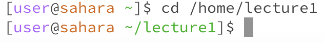
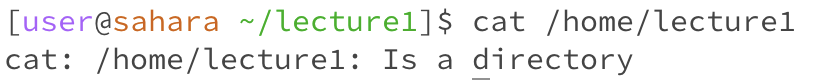
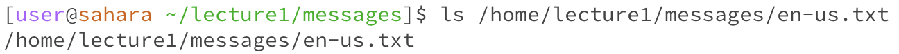
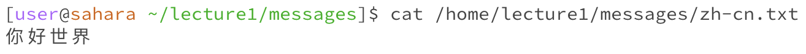

# Lab Report 1:
---
## **Examples of using the command `cd` `ls` `cat` with *no* arguments**
1. `cd`
   * 
   * The working directory when the command was run is `/home`.
   * Using the command with no argument in this case with `cd` means there's no directory it can be changed into. Hence in the filesystem it would only be `/home` as the given path does not have any files to be print out. Futher explains why the output is empty with nothing being printed out.
   * The output is not an error.
2. `ls`
   * 
   * The working directory when the command was run is `/home`.
   * Using the `ls` command with no argument means it would list the files and folders of the given path, in this case with no given path it would list out the single folder within the filesystem `/home`, makes the output `lecture1` in blue and bolded font.
   * This output is not an error.
3. `cat`
   * 
   * The working directory when the command was run is `/home`.
   * Using the `cat` command with no argument would not print out any contents as there isn't any contents of any files within the given path, path are the argument, hence there's nothing for `cat` to read and prints out as output.
   * This output is an error, because it would keep on repeating to print out a blank output with the blank argument non-stopping.

## **Examples of using the command `cd` `ls` `cat` with a path to a *directory* as an argument**
1. `cd` with path to a *directory*
   * 
   * The working directory when the command was run is `/home`.
   * Using the `cd` command with a path `/home/lecture1` as an argument permits the switch from the current working directory `/home` to the given path `/home/lecture1`, the directory have been successfully changed with the terminal display in green with `~/lecture1`.
   * This output is not an error.
2. `ls` with path to a *directory*
   * 
   * The working directory when the command was run is `/home/lecture1`.
   * Using the `ls` command with a path `/home/lecture1` as an argument would list out all the name of the files and folders within the filesystem, and in this case from `/home/lecture1`. `Hello.class`, `Hello.java`, `messages` and `README` are the four files and folder within the `lecture1` folder that are being listed out.
   * This output is not an error.
3. `cat` with path to a *directory*
   * 
   * The working directory when the command was run is `/home/lecture1`.
   * Using the `cat` command with a path `/home/lecture1` would print out an error as an output, since the command `cat` are used to print out the contents of the files that are given by the path, and in this case the folder within the filesystem `/home/lecture1` does not contain a file with content that it can be read and be printed.
   * This output is an error, as the argument `/home/lecture1` is a directory instead of a file that can be read by the terminal.

## **Examples of using the command `cd` `ls` `cat` with a path to a *file* as an argument**
1. `cd` with path to a *file*
   * 
   * The working directory when the command was run is `/home/lecture1/messages`.
   * Using the `cd` command with a path `/home/lecture1/messages/en-us.txt` would give out an error, since the `cd` command are used to switch the working driectory to the given path. And in this case with a file, nothing can be switch. Hence that the `cd` command would only be used with a path to a directory as an argument instead of with a path to a file as an argument.
   * This output is an error as the path `/home/lecture1/messages/en-us.txt` is being stated as not a directory that can be used.
2. `ls` with path to a *file*
   * 
   * The working directory when the command was run is `/home/lecture1/messages`.
   * Using the `ls` command with the path `/home/lecture1/messages/en-us.txt` would also give out an error, this is because there are no other files and folders within the given path. Hence it would just print back out the given path as the list.
   * This output is an error as the path `/home/lecture1/messages/en-us.txt` does not contain any other files and folders within.
3. `cat` with path to a *file*
   * 
   * The working directory when the command was run is `/home/lecture1/messages`.
   * Using the `cat` command it would print out the contents of the file with the given path `/home/lecture1/messages/zh-cn.txt`, hence the output "你好世界" is being printed out from the file of `zh-cn.txt`.
   * This output is not an error.
