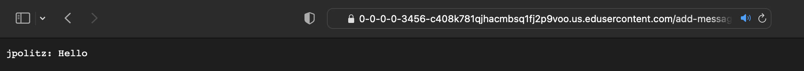
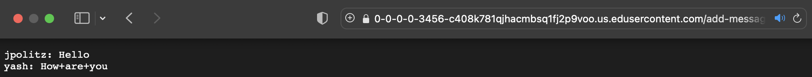
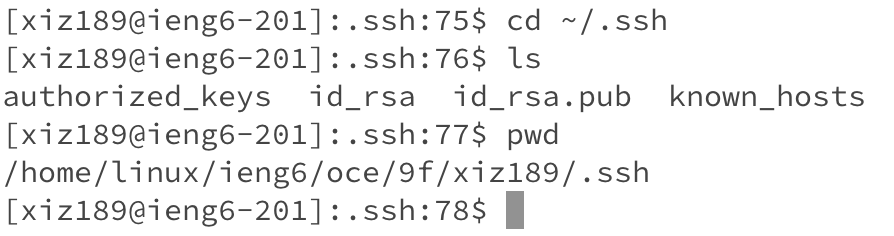
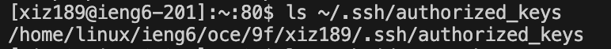
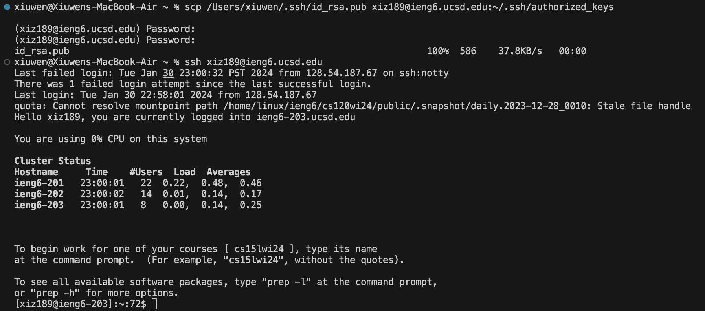

# **Lab Report 2:**
---
## **Part 1**
**Code of `ChatServer`**
```
import java.io.IOException;
import java.net.URI;

class Handler implements URLHandler {
    String chatMessages = "";

    public String handleRequest(URI url) {
        if(url.getPath().equals("/")) {
            return "What is the message implemented?";
        }
        else if (url.getPath().equals("/add-message")) {
            String query = url.getQuery();
            int messageIndex = query.indexOf("s=");
            int ampersandIndex = query.indexOf("&");
            int userIndex = query.indexOf("user=");

            if(messageIndex != -1 && userIndex != -1) {
                String message = query.substring(messageIndex + 2, ampersandIndex);
                String user = query.substring(userIndex + 5);
                chatMessages +=String.format("%s: %s%n", user, message);
            }
            return chatMessages.toString();
        } else {
            return "404 Not Found!";
        }
    }
}

class ChatServer {
    public static void main(String[] args) throws IOException {
        if(args.length == 0) {
            System.out.println("Missing port number! Try any number between 1024 to 49151");
        }
        int port = Integer.parseInt(args[0]);
        Server.start(port, new Handler());
        }
}
```

**Using the `/add-message` on the port `3456` that prints out the message**
* `/add-message?s=Hello&user=jpolitz`
* Link: https://0-0-0-0-3456-c408k781qjhacmbsq1fj2p9voo.us.edusercontent.com/add-message?s=Hello&user=jpolitz

1. The methods that are called in my code are the `handleRequest` method. This method takes in the URI parameter as input, and in this case for the URI `url` the input is `/add-message?s=Hello&user=jpolitz`. Furthermore uses the `getPath()` and `getQuery()` to gather the information that we wanted to be printed out, which is the message after the `s=` and the user name after ther `&user=`. Then stores it in the String `chatMessages`. Thus, it would be able to be printed out when the `toString()` is called.
2. The relevant argument to the method are the `URI url`, with the `/add-message?s=Hello&user=jpolitz` as the parameter of `url`, the request information.The value of the relevent field of `Handler` class implements `URLHandler` is the `chatMessages` being empty and have nothing as initialization.
3. After the request, the value of the relevant field `chatMessages` gets update to `"jpolitz: Hello\n"` with a newline character.
   
* `/add-message?s=How are you&user=yash`
* Link: https://0-0-0-0-3456-c408k781qjhacmbsq1fj2p9voo.us.edusercontent.com/add-message?s=How are you&user=yash

1. The method that are bing called is the `handleRequest` again, going through the same information as the first message.
2. The relevant argument are again `URI url`, but this time with the parameter of `url` being `/add-message?s=How are you&user=yash`. The value of the relevant field of the `Handler` class is the String `chatMessages` being added in information that now are `"jpolitz: Hello\n"` before the new request are being take in.
3. After the request, the values of the relevant field `chatMessages` becomes `"jpolitz: Hello\nyash: How are you\n"`(while the space are represented with plus sign in this case).

## **Part 2**
* The absolute path to the *private* key for my SSH key for logging into `ieng6`

* The absolute path to the *public* key for my SSH key for logging into `ieng6`

* A terminal interaction where I log into my `ieng6` account *without* being asked for a password


## **Part 3**
*Something that I learned from labs through week 2 and 3 are the new information regarding the URL and server. Things such as using the `ssh` command to connect to the remote server on edstem. Where the connection made through `ssh` are more secure. And also creating our own web server through the implementation of Java. With these, now it permits me to build on my own URL and server. These was something that I don't know before, despite I have been using it throughout daily life. But the process of building and tseting them out was interesting as I was able to see them successfully launched.


