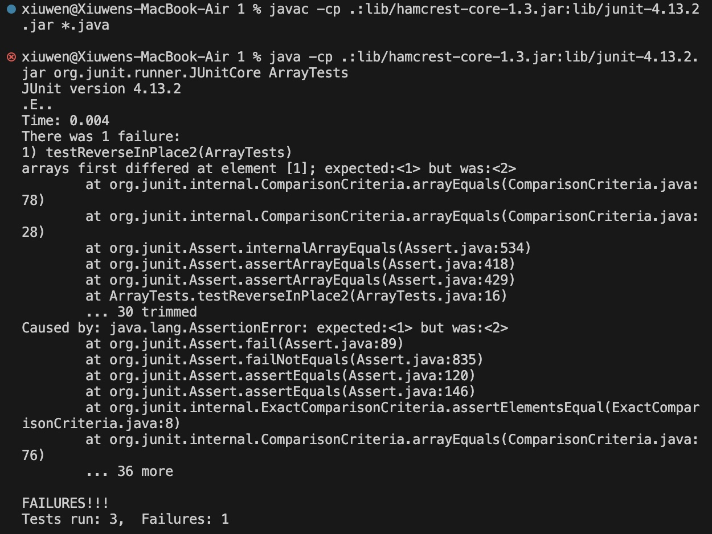

# **Lab Report 3:**
---
## **Part 1 - Bugs**
The method from the `ArrayExamples.java` that the bugs are on:
```java
public class ArrayExamples {
  // Changes the input array to be in reversed order
  static void reverseInPlace(int[] arr) {
    for(int i = 0; i < arr.length; i += 1) {
      arr[i] = arr[arr.length - i - 1];
    }
  }
```
From the `ArrayTests.java`:
* A failure-inducing input for this buggy program, as a JUnit test and any associated code:
```java
public class ArrayTests {
	@Test 
	public void testReverseInPlace2() {
    int[] input1 = {1, 2};
    ArrayExamples.reverseInPlace(input1);
    assertArrayEquals(new int[]{2, 1}, input1);
	}
```
* An input that doesn't induce a failure, as a JUnit test and any associated code:
```java
public class ArrayTests {
	@Test 
	public void testReverseInPlace() {
    int[] input1 = {2};
    ArrayExamples.reverseInPlace(input1);
    assertArrayEquals(new int[]{2}, input1);
	}
```
* The symptom, as the output of running the tests:
  - The array {1, 2} are not being reversed correctly as {2, 1}

* The bug, as the before-and-after code change required to fix it:
  - Before the code change:
  ```java
  static void reverseInPlace(int[] arr) {
    for(int i = 0; i < arr.length; i += 1) {
      arr[i] = arr[arr.length - i - 1];
    }
  }
  ```
  - After the code change:
  ```java
  static void reverseInPlace(int[] arr) {
    for(int i = 0; i < arr.length; i += 1) {
      int temp = arr[i];
      arr[i] = arr[arr.length - i - 1];
      arr[arr.length - i - 1] = temp;
    }
  }
  ```
* Why the fix addresses the issue?
  - By introducing a variable `temp`, it stores the value of `arr[i]` inside before it gets overwritten. And as for the original code, since the original values in the array are not being saved, when going over the iteration, all the element are being overwritten and becomes the same. But by saving and stores the element's original value into `temp`, the swap of the values happens correctly with the reserve of the original values of the array.
    
---
## **Part 2 - Researching Commands**
Informations about the command `grep`

**Option 1:**
* -c, --count: counts the matching lines for each input file or directories
  
  Example 1)
  ```java
     grep -c "it" ./technical/biomed/cc300.txt
     119
  ```
  Example 2)
  ```java
     grep -c "the" ./technical/plos/pmed.0010008.txt
     124
  ```
   - `grep -c` counts how many times a specific word appears in the file, and gives out the total count of the word instead of lines of where the word is at. This is useful as it can count out how many times the word shows up in the file without showing the actual line that containes the word.
       
**Option 2:**
* -l, --files-with-matches: out prints the name of the file that contain the specified word
  
  Example 1)
	```java
     grep -r -l "microbiologist" technical
     technical/plos/journal.pbio.0030056.txt
     technical/biomed/1471-2180-2-22.txt
     technical/biomed/1471-2458-2-3.txt
     technical/biomed/1471-2164-3-4.txt
     technical/biomed/1471-2334-3-13.txt
	```
  Example 2)
	```java
     grep -r -l "marine biologist" technical
     technical/plos/journal.pbio.0030127.txt
     technical/plos/journal.pbio.0020113.txt
	```
	- The `-r` that means "recursive" before the `-l` means it would allow the `grep` command to search to not only the files in the specified path but all the dictories and files within.
	- `grep -l` lists out the name of the files quickly with the indicated specified word contained inside the file, it makes it efficient in searching for the files that are interested in. Without showing the actual lines that contains the word, it shows the file name that contains the designated word.

**Option 3:**
* -o, --only-matching: prints only the matching part of the lines that are searching for
  
  Example 1)
  ```java
     grep -o "ones" ./technical/911report/chapter-7.txt
     ones
     ones
     ones
     ones
     ones
  ```
  Example 2)
  ```java
     grep -o "before" ./technical/biomed/1471-2121-2-6.txt
     before
     before
  ```
 	- `grep -o` is useful as it picks out the specified information or word from the large text file full of words and sentences, by printing out only the specified word or phrase that are matched within the text file.

**Option 4:**
* -v, --invert-match: it selects lines that do not match any of the specified patterns
  
  Example 1)
  ```java
     grep -v "the" ./technical/plos/pmed.0020281.txt
     whistleblowing—as discussed, in part, in 
        courageous men and women [1, 2] For that reason, those of us who congregated in Washington,
        research.
        misrepresented pharmaceuticals; clinical research trial results that have been sequestered
        pharmaceuticals that are detailed to physicians, not to save lives or necessarily improve
        corporations and political interests whose operations we occasionally challenge. Our goal
        assault of unprecedented odds against being heard put forth by that sum of political power,
        expediency, and money.
        A whistleblower's success depends upon competent and articulate media. The debate to
        making—cannot proceed or flourish without it.
        Ralph Waldo Emerson, American essayist and philosopher (1803–1882), commented about
        this is to have succeeded [as a whistleblower].”
     ```
  Example 2)
  ```java
     grep -v "in" ./technical/government/Media/Advocate_for_Poor.txt
     New York Daily News
     Tuesday, May 7, 2002
     Advocate for Poor Has Own Obstacles
     Greg Wilson
     of legal work he'd always dreamed of, but after less than a year of
     Nearly a year ago, Mazzariello, a former assistant district
     of his East New York Legal Services Corp. on New Lots Ave.
     got some help from high places early on.
     "I picked up the phone and called Rudy Giuliani on his radio
     all the paperwork. We got the nonprofit status from the feds. We
     state status that would allow it to survive on charitable
     donations.
     "This is what I want to do - to give back to the community,"
     said Mazzariello, who worked under Brooklyn District Attorney
     of Education's chief prosecutor.
     tenant ownership program, Mazzariello and partner Joe Guzzo learned
     room makeover and other modest improvements.
     Another Bidder
     Then, last week, Mazzariello got bad news from the department. A
     Department spokeswoman Carol Abrams said homeownership comes
     "We give priority to the residential tenants because we're a
     units above the storefront legal practice, plans to buy the
     the commercial space a must. That could amount to several times as
     Preservation and Development Department.
     to" the department.
     ```
 	- `grep -v` is useful as it permits to filter out information that does not contain the specified word or phrases from the text file. It prints out the lines that doesn't contain the specified word, which helps to sort out the helpful information that are needed.

**All descriptions of the command line are source from the command `man grep`**

