# **Lab Report 4: Vim**
---
**Steps 1 - Setup: Delete any existing forks of the repository you have on your account**
- Remove the existing fork with command `rm -rf lab7<enter>`
- 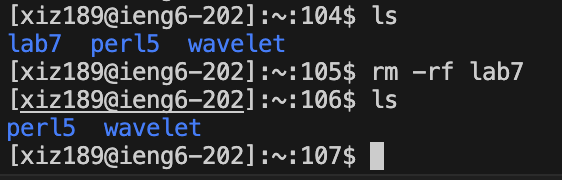

**Step 2 - Setup: Fork the repository**
- Fork the lab7 repository
- 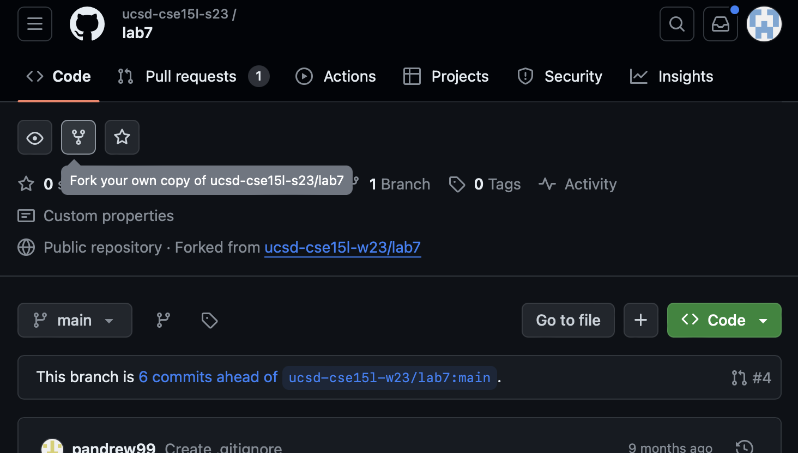

**Step 3 - The real deal, Start the timer!**
- Would start the timer to time the progress

## **Steps 1-3 are setups!!**

## **Step 4 - Log into `ieng6`**
- Key pressed: `ssh xiz189@ieng6.ucsd.edu<enter>`
- It permits me to log into the `ieng6` server without asking for a password, this is because I have previously generated a ssh key that stores as my public ssh key on the server. Which allows me to save up the time that are needed to type in the password, and log in immediately.
- 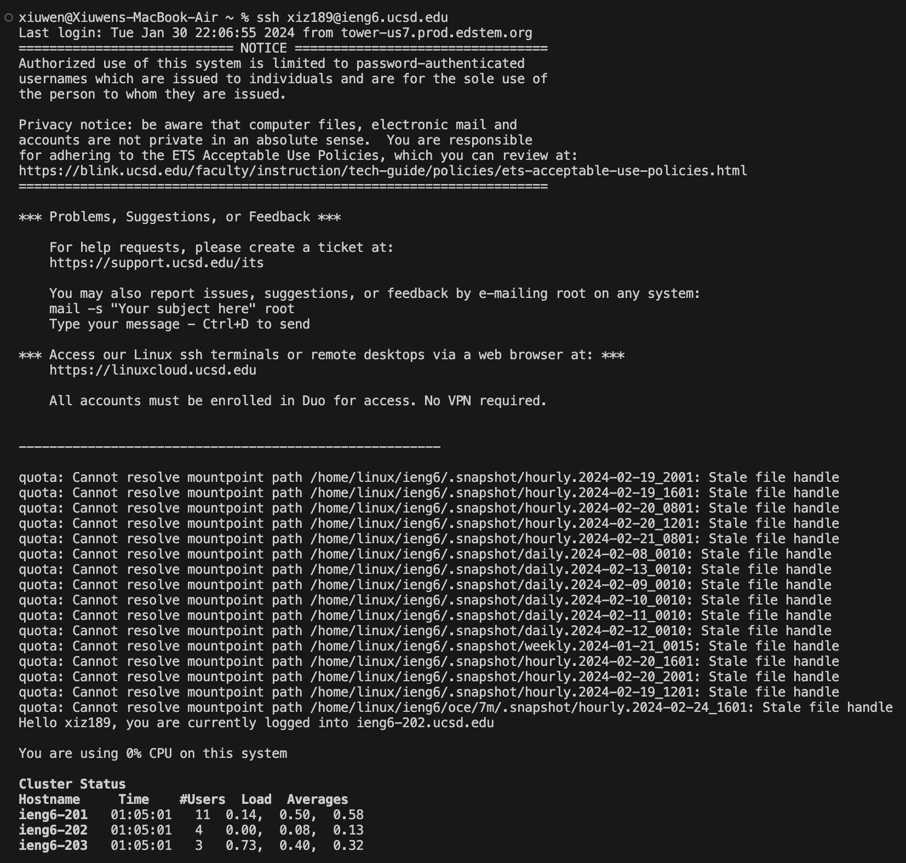

## **Step 5 - Clone the fork of the repository from my GitHub account (using the SSH URL)**
1. Key pressed: `git clone git@github.com:Xwinner7/lab7.git<enter>`
- It allows me to clone the repository into my own terminal with the ssh key that I have generated for GitHub, where I could just use clone from the `SSH` instead of the normal `HTTPS`. The ssh key generated on the server of `ieng6` has been added as my public key into my GitHub account.
- 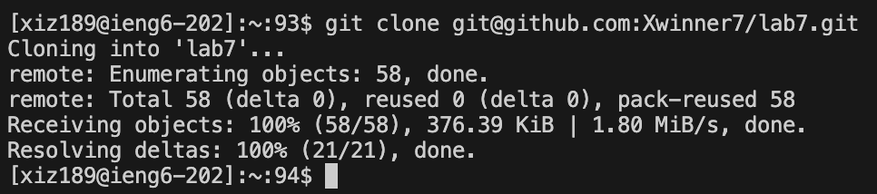
2. Key Pressed: `cd lab7<enter>`
- Which permits me to enter into the directory of the cloned repository, with the directory named `lab7`.
- 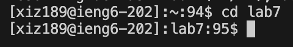

## **Step 6 - Run the tests, demonstrating that they fail**
1. Key pressed: `ls<enter>`
- Which allows me to see what contents are contained within the `lab7` directory, all the files.
- 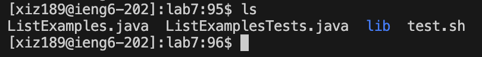
2. Key pressed: `bash test.sh<enter>`
- This command permit the script to run the JUnit tests.
- 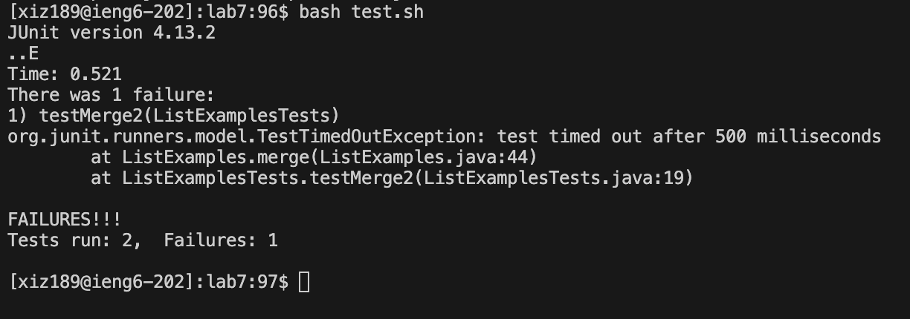
  - Where it indicate 1 test failed.

## **Step 7 - Edit the code file to fix the failing test**
1. Key pressed: `vim ListExamples.java<enter>` or it could be `vim Li<tab>.java<enter>`
- This command would open the designated file in vim, the second way to write this command with the `<tab>` fills in the file name to be `ListExamples`, saved a few second from typing.
- 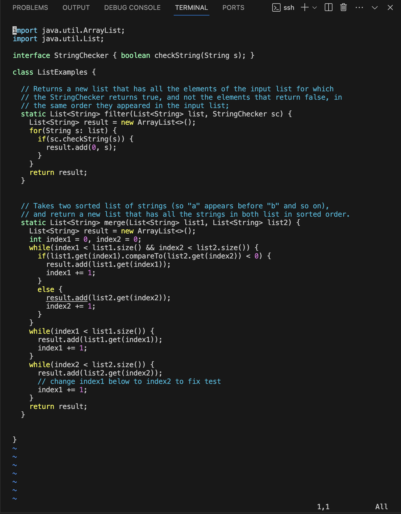
2. Key pressed to find and fix the buggy code: `/index1<enter>`, `n`(9 times), `l`(5 times), `r`, `2`
- This command would search and leads directly to the word that first appeared with the name `index1` in the file. Afterward, press the `n` key for it to jump to the next search of `index1` and finally stops after pressing it 9 times to where the buggy code is. Next, the `l` key are being pressed 5 times to get to the position of where the number '1' is at the variable name, which are the error to fix. Then press the `r` key to be in insert mode and selected the current index, follow by pressing the `2` key to change the variable name from `index1` to be `index2`
- 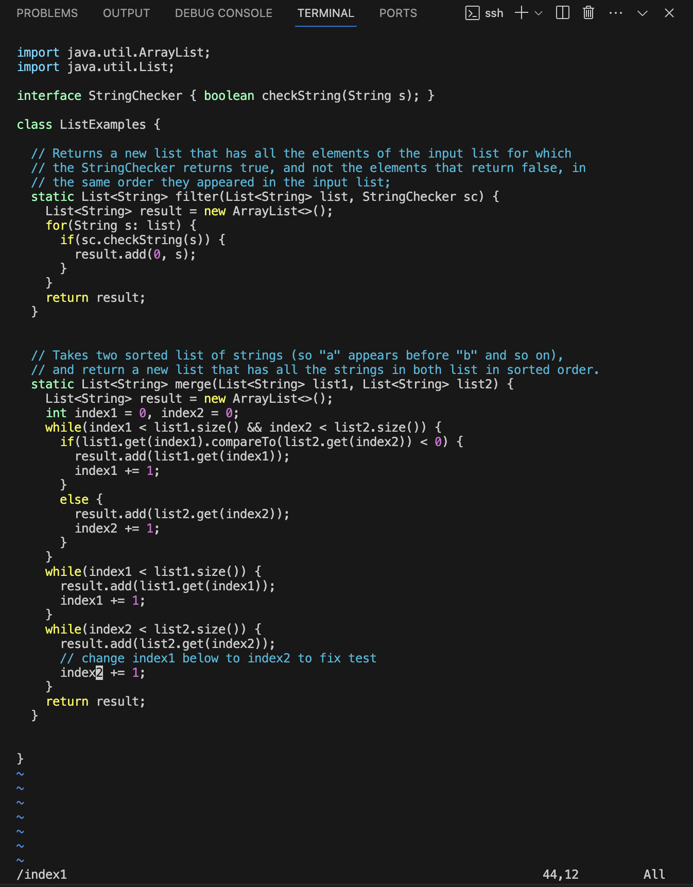
3. Key pressed: `<esc>`
- This command would exit out of the insert mode after the bug fix and be back into normal mode.
4. Key pressed: `:wq<enter>`
- This command allows the change that we made to be saved and exit out of vim, back to the terminal.
- 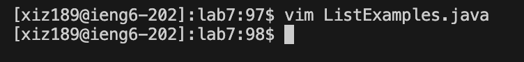

## **Step 8 - Run the tests, demonstrating that they now succeed**
- Key pressed: `bash test.sh<enter>`
- This command just as before, the script of the JUnit tests gets run.
- 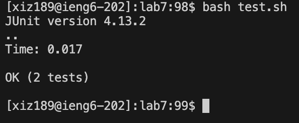
  - All the test are passed after the fix of the bug in code through vim

## **Step 9 - Commit and push the resulting change to my Github account**
- Key pressed: `git add ListExamples.java<enter>`, `git commit -m "Bug fixed"<enter>`, `git push<enter>`
- The file `ListExamples.java` gets add with the command `git add`, by the command `git commit` the change is commit with the message "Bug fixed", and lastly the `git push` command push the changes to the remote repository, GitHub.
- 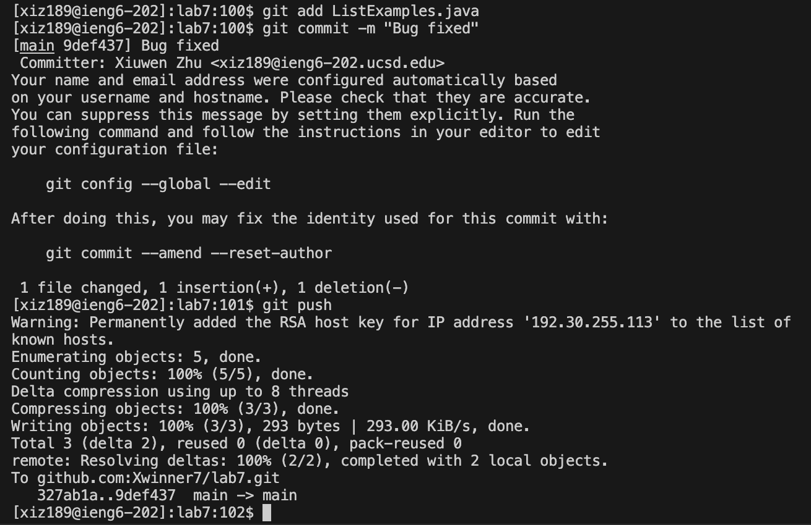
