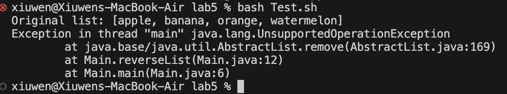
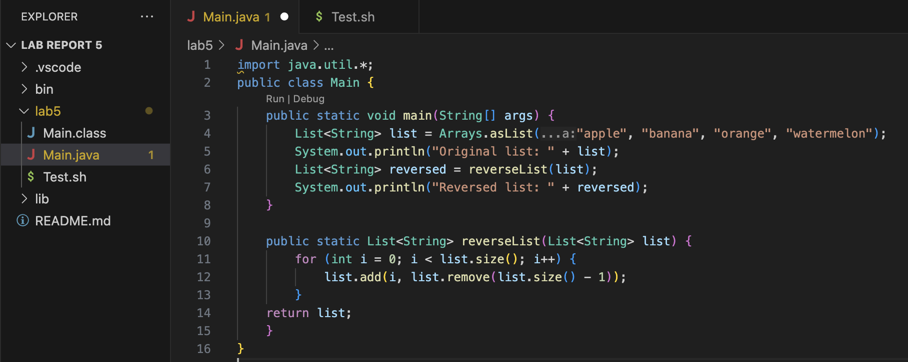
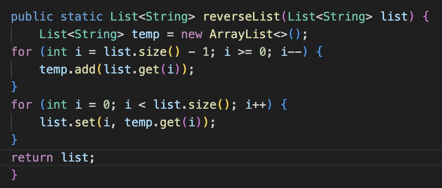
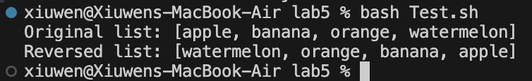
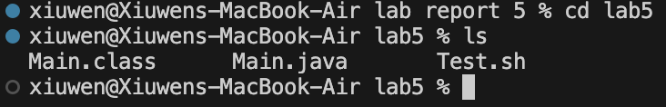
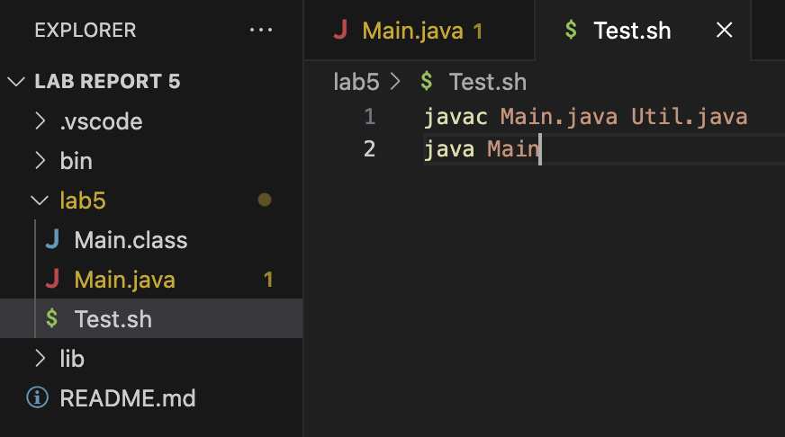
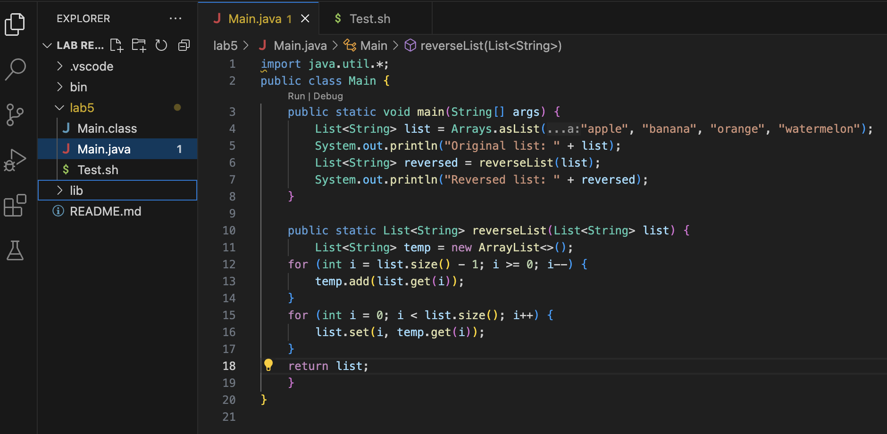

# **Lab Report 5 - Putting it All Together**
---
## **Part 1 - Debugging Scenario**

**Original Post by Student:**
---
Hello there!

I'm having trouble with my codes where I'm trying to reverse a list of strings. Instead of fully reversing the list, it doesn't seem to reverse correctly for the inputs, and I'm not sure what's going wrong. Here's the problematic part of my code with the input and output:
- run error

- error method

With the original input being `{"apple", "banana", "orange", "watermelon"}`, I initally thought the bug is how I'm swapping the elements or the loop, but it outputs an `UnsupportedOperationException`. Which I resolved using a new `ArrayList`, however it still didn't output the correct reversed inputs. Any ideas on how I could fix this bug?

**Response from TA:**
---
Hi,

Glad that you were able to catch the exception. The approach you've taken in `reverseList` seems logical, but may lead to unexpected reults due to the way you're modifying the list while iterating over it. Modifying a list during iteration can be tricky and lead to unpredictable behavior. To help with the fix of the bug, could you add print statements within your `reverseList` method to see the output of the list at each iteration of your loop? This which will give out a clearer picture of how the list is being reversed at each step. Hope that helps!

**Follow-Up by Student:**
---
Based on the advices, I added print statements for my `reverseList` method, which further leads me to the bug. Where the list is being modified as I iterate over it, which messes up the indices and leads to incorrect placement of the elements of the list. To fix it, I have updated my `reverseList` method to this below:


Now it would correctly reverses the list, and prints the correct output:
 

Thank you so much for the help!!

**File and Directory Structure**
---
Inside of the `lab5` folder, I created the files below:
- `Main.java` that contains the program
- `Tesh.sh` that compiles and runs the java file `Main.java`
  

**Contents of the Files**
---
- `Main.java` with the bug before fixing
  
- `Test.sh`
  

**Command to Trigger the Bug**
---
- `bash Test.sh`, which runs the command `javac Main.java` and `java Main` that prints the output in the terminal

**How to Fix the Bug**
---
- In order to fix the bug, would replace the loop inside of the `reverseList` method from 
```java
for (int i = 0; i < list.size(); i++) {
            list.add(i, list.remove(list.size() - 1));
        }
```
to
```java
 List<String> temp = new ArrayList<>();
    for (int i = list.size() - 1; i >= 0; i--) {
        temp.add(list.get(i));
    }
    for (int i = 0; i < list.size(); i++) {
        list.set(i, temp.get(i));
    }
```
- Which produced the corrected method that runs output successfully:


## **Part 2 - Reflection**
Before taking this course, shell scripting is something that is new to me. I would be typing the same commands over and over again in the terminal, which was really exhausting and time consuming. But now, after taking this class, I have learned how to save these repetitive commands in a shell script, making it much easier to run them all at once. This new approach has also saved a ton of time for the coding process, since I could bundle common commands into these scripts. Also, I have realized the powerful usage of `Vim`, which permits me to edit the code without needing a mouse. And mastering in those `Vim` commands would make a huge difference in how quickly changes and edits can be made right of the keyboard. This course has broadened my knowledge and skills in coding and computing, earns me some valuable techniques that boosted my productivity.


